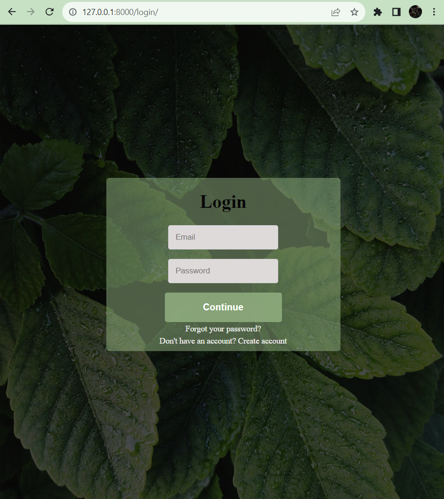

# fitflow
This is a summer side project django menstrual tracking app that gives workout recommendations based off fitness goals and cycle phase. This prototype app, called fitflow, uses machine learning, flatpickr calendar, custom user authentication, etc.
Note that code is in master branch!

# How to Use This App Yourself!

1. Clone this project
2. Activate the virtual environment
3. Activate redis server
4. Run the project on your command prompt via manage.py file
5. Enjoy!

# How to Tweak This Project For Your Own Uses

Since this is a protoype app, there is room for improvement and personalization such as adding more workout recommendations for each cycle phase!

# Known Issues

The main page after you create an account and log in is still under aesthetic development. 
